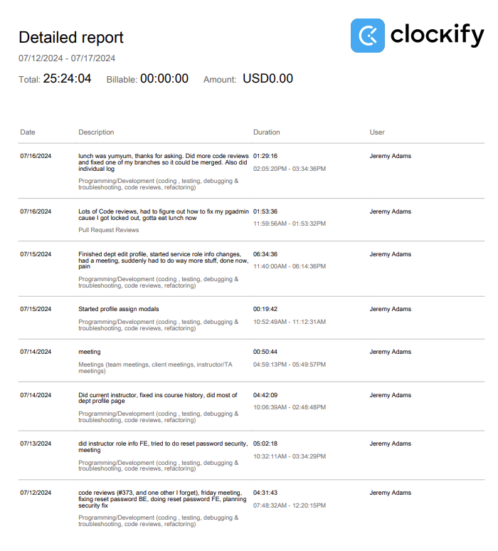
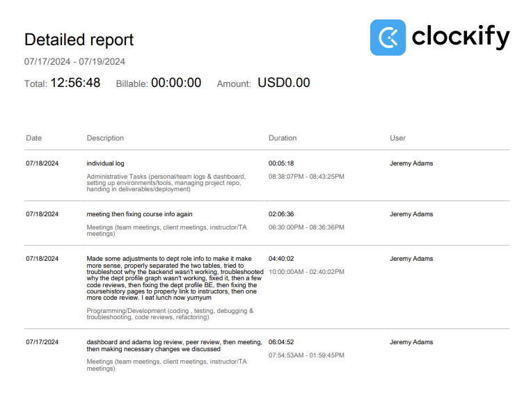

# Week 10

## Wednesday (07/17/2024)

### Timesheet

### Current Tasks
  * #1: Begin working on refactoring and thouroughly testing all the FE pages I worked on, starting with the instructor side

### Progress Update (since 07/12/2024)
<table>
    <tr>
        <td><strong>TASK/ISSUE #</strong>
        </td>
        <td><strong>STATUS</strong>
        </td>
    </tr>
    <tr>
        <!-- Task/Issue # -->
        <td>Finish reset password FE
        </td>
        <!-- Status -->
        <td>Complete
        </td>
    </tr>
    <tr>
        <!-- Task/Issue # -->
        <td>Do dept edit profile page
        </td>
        <!-- Status -->
        <td>Complete
        </td>
    </tr>
    <tr>
        <!-- Task/Issue # -->
        <td>Front end for instructor service role info
        </td>
        <!-- Status -->
        <td>Complete
        </td>
    </tr>
      <tr>
        <!-- Task/Issue # -->
        <td>Make necessary changes to course info page
        </td>
        <!-- Status -->
        <td>Complete
        </td>
    </tr>
        <tr>
        <!-- Task/Issue # -->
        <td>Make necessary changes to service role info page
        </td>
        <!-- Status -->
        <td>Complete
        </td>
    </tr>
      </tr>
        <tr>
        <!-- Task/Issue # -->
        <td>Try to fix reset password security
        </td>
        <!-- Status -->
        <td>Incomplete (fail)
        </td>
    </tr>
</table>

### Cycle Goal Review
This cycle was crazy! Our goal was to finish all of our features by the end of Sunday, so I had to work really hard to try to reach that deadline. Even with all
the extra time I was putting in the work just kept piling on and I was still only able to finish by Monday afternoon. It was definetly the most difficult and
stressful cycle for me so far, but I'm still pretty happy with the result. Within all that, I also had to try to fix the reset password security problem, but I
was unfortunately not able to do it and had to move on because of the time crunch. I'm still a little worried about that, so hopefully it gets worked out eventually.
Overall, I'm content with where the project is right now, and I'm happy to get started on the next step, which according to our plan, is refactoring.

### Next Cycle Goals
  * Make satisfying progress on refactoring and testing all my pages, starting with the instructor side

<!--------------------------------------------------------------------------------------------------------------------------------------------------------------------------------------------->
## Friday (07/19/2024)

### Timesheet

### Current Tasks
  * #1: Begin working on refactoring and thouroughly testing all the FE pages I worked on, starting with the instructor side

### Progress Update (since 07/17/2024)
<table>
    <tr>
        <td><strong>TASK/ISSUE #</strong>
        </td>
        <td><strong>STATUS</strong>
        </td>
    </tr>
    <tr>
        <!-- Task/Issue # -->
        <td>Make sure all pages are working before the testorama on friday
        </td>
        <!-- Status -->
        <td>Complete
        </td>
    </tr>
</table>

### Cycle Goal Review
This mini-cycle, we realized we needed to make sure all of our pages were working 100% before the testing event on Friday. We suddenly noticed a lot of bugs and things that needed to be fixed,
and it also didn't help that we were experiencing a lot of GitHub merge problems, losing code and having to put it back in. Because of all this I wasn't able to get started on my previous goal
of refactoring, but now that we're done all that I'm hoping to get started on that as soon as I can.

### Next Cycle Goals
  * Make satisfying progress on refactoring and testing all my pages, starting with the instructor side

