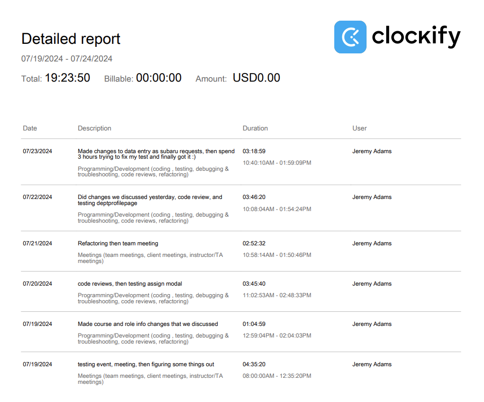

# Week 11

## Wednesday (07/24/2024)

### Timesheet

### Current Tasks
  * #1: Finish testing and refactoring DeptProfilePage
  * #2: Move on to testing and refactoring other pages I worked on

### Progress Update (since 07/19/2024)
<table>
    <tr>
        <td><strong>TASK/ISSUE #</strong>
        </td>
        <td><strong>STATUS</strong>
        </td>
    </tr>
    <tr>
        <!-- Task/Issue # -->
        <td>Write test for data entry page
        </td>
        <!-- Status -->
        <td>Complete (but unfortunately we changed the data entry page after I did this so now it's somewhat useless)
        </td>
    </tr>
    <tr>
        <!-- Task/Issue # -->
        <td>Remove various elements from data entry page
        </td>
        <!-- Status -->
        <td>Complete
        </td>
    </tr>
    <tr>
        <!-- Task/Issue # -->
        <td>Change the title and sidebar for data entry to make more sense, and add a placeholder for course code
        </td>
        <!-- Status -->
        <td>Complete
        </td>
    </tr>
      <tr>
        <!-- Task/Issue # -->
        <td>Test and refactor DeptProfilePage
        </td>
        <!-- Status -->
        <td>In Progress
        </td>
    </tr>
</table>

### Cycle Goal Review
This cycle was very productive! Our testing session on Friday went extremely well, and there was only a couple small complaints we recieved, which were very easy to fix. They mostly involved
the Data Entry page being confusing to find, and the course creation lacking placeholders for easier understanding. I took care of those issues, so now we're looking very good for the 
next testing event. Over the weekend we had a meeting and decided we needed to slightly alter the structure of our system to make it more re-usable, so we all understood what needed to be done
and worked on it. All I needed to do was delete a few sections of the data entry page, so it was pretty easy on my end. AFter that, I got started on testing and refactoring the DeptProfilePage,
and ran into a really pesky testing error that took me a good while to fix. Luckily I was able to figure it out today, so I'll continue working on that going forward.

### Next Cycle Goals
  * Finish testing and refactoring the DeptProfilePage
  * Hopefully get started on another page if I finish DeptProfilePage quickly enough

<!--------------------------------------------------------------------------------------------------------------------------------------------------------------------------------------------->
## Friday (07/26/2024)

