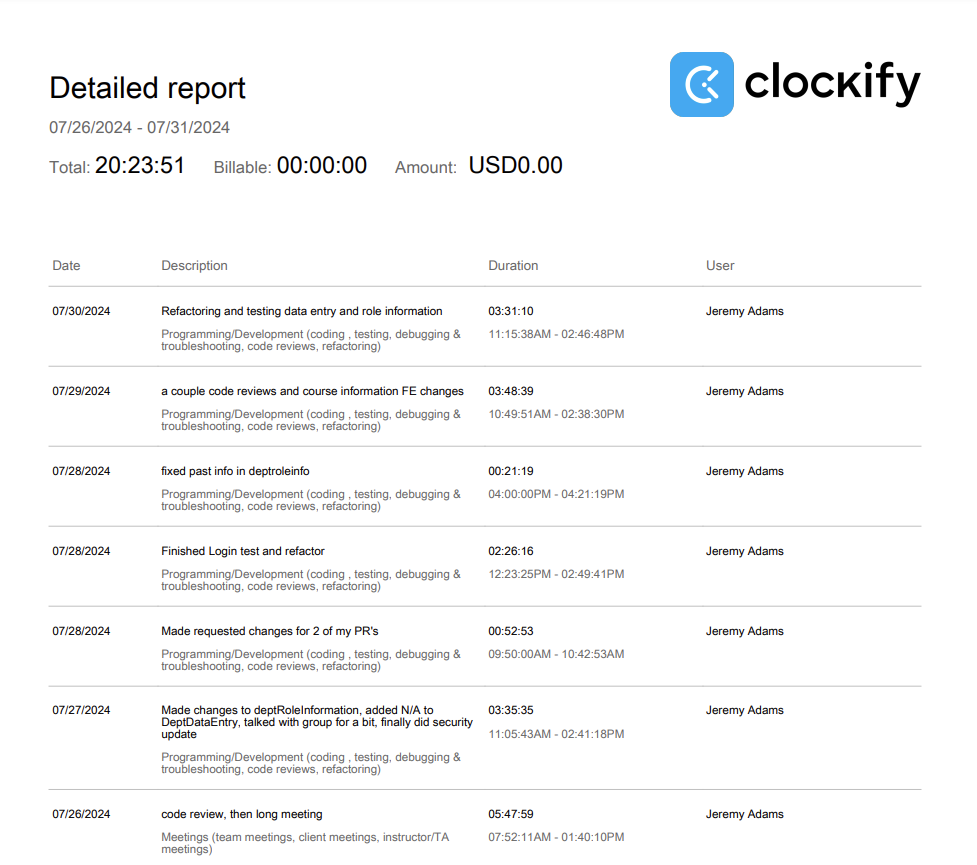

# Week 11

## Wednesday (07/31/2024)

### Timesheet

### Current Tasks
  * #1: Finish testing and refactoring DeptRoleInformation
  * #2: Finish testing and refactoring DeptCourseInformation

### Progress Update (since 07/26/2024)
<table>
    <tr>
        <td><strong>TASK/ISSUE #</strong>
        </td>
        <td><strong>STATUS</strong>
        </td>
    </tr>
    <tr>
        <!-- Task/Issue # -->
        <td>Test and refactor Login page
        </td>
        <!-- Status -->
        <td>Complete
        </td>
    </tr>
    <tr>
        <!-- Task/Issue # -->
        <td>Improve reset password email security
        </td>
        <!-- Status -->
        <td>Complete
        </td>
    </tr>
    <tr>
        <!-- Task/Issue # -->
        <td>Test and refactor Login page
        </td>
        <!-- Status -->
        <td>Complete
        </td>
    </tr>
      <tr>
        <!-- Task/Issue # -->
        <td>Make changes to DeptCourseInformation that we discussed
        </td>
        <!-- Status -->
        <td>Complete
        </td>
    </tr>
        <tr>
        <!-- Task/Issue # -->
        <td>Make changes to DeptRoleInformation that we discussed
        </td>
        <!-- Status -->
        <td>Complete
        </td>
    </tr>
        <tr>
        <!-- Task/Issue # -->
        <td>Change 'All' to 'N/A' in data entry page
        </td>
        <!-- Status -->
        <td>Complete
        </td>
    </tr>
</table>

### Cycle Goal Review
This cycle was very busy! On friday we decided that we wanted to include every requirement from the email we got, so we discussed as a group how we were going to achieve that.
I made some changes to the front end for course info and role info, fixing some bugs and adding in the new data we needed. Around that time I also decided I was just going to fix the
email security myself and luckily it didn't take that long at all. I basically just encrypted the email with a specific password, sent it through the URL, then decrypted it once the user
reaches the reset page. I also made a lot of progress on all my tests and refactoring this cycle, and now I'm realllyyy close to being done. I only have like 1.5 pages left to do so I'm really
hoping I can get that done by Friday.

### Next Cycle Goals
  * Finish testing and refactoring all my pages

<!--------------------------------------------------------------------------------------------------------------------------------------------------------------------------------------------->
## Friday (07/26/2024)

