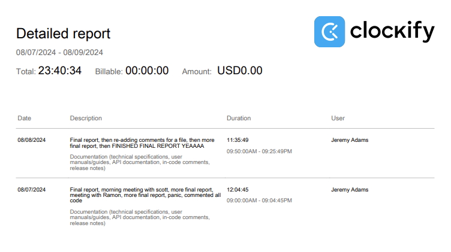

# Week 13 

## Wednesday (08/07/2024)

### Timesheet

### Current Tasks
  * #1: Finish final report

### Progress Update (since 07/26/2024)
<table>
    <tr>
        <td><strong>TASK/ISSUE #</strong>
        </td>
        <td><strong>STATUS</strong>
        </td>
    </tr>
    <tr>
        <!-- Task/Issue # -->
        <td>Finish final report
        </td>
        <!-- Status -->
        <td>In progress
        </td>
    </tr>
    <tr>
        <!-- Task/Issue # -->
        <td>Make visual adjustments to course page
        </td>
        <!-- Status -->
        <td>Complete
        </td>
    </tr>
      <tr>
        <!-- Task/Issue # -->
        <td>Course and Service Role page bug fixes
        </td>
        <!-- Status -->
        <td>Complete
        </td>
    </tr>
        <tr>
        <!-- Task/Issue # -->
        <td>Refactor DeptProfilePage again
        </td>
        <!-- Status -->
        <td>Complete
        </td>
    </tr>
        <tr>
        <!-- Task/Issue # -->
        <td>Refactor Login page again
        </td>
        <!-- Status -->
        <td>Complete
        </td>
    </tr>
</table>

### Cycle Goal Review
This cycle was a lot of work, but it's the final stretch! Most of my time was spent chipping away at the final report, however on Monday my team pointed out some changes I had to make to the system at the last minute, 
and it was difficult. I had to ask for help and Zhiheng decided to help so I'm grateful to him for that. Now we just had the requirements meeting, which we kinda messed up on so we're going back Wednesday morning to
properly show Scott all of our requirements.

### Next Cycle Goals
  * Finish Final Report
  * Be prepared for presentation
<!--------------------------------------------------------------------------------------------------------------------------------------------------------------------------------------------->
## Friday (08/09/2024)

### Timesheet

### Current Tasks
  * #1: Prepare for final presentation
  * #2: Hand in final document

### Progress Update (since 07/26/2024)
<table>
    <tr>
        <td><strong>TASK/ISSUE #</strong>
        </td>
        <td><strong>STATUS</strong>
        </td>
    </tr>
    <tr>
        <!-- Task/Issue # -->
        <td>Finish final report
        </td>
        <!-- Status -->
        <td>Complete
        </td>
    </tr>
        <tr>
        <!-- Task/Issue # -->
        <td>Comment all my files
        </td>
        <!-- Status -->
        <td>Complete
        </td>
    </tr>
</table>

### Cycle Goal Review
This cycle was the most stressful grind yet... I worked on the final report 24/7 this cycle, and I'm finally done! I also had to comment some files, which took some time.

### Next Cycle Goals
  * Do presentation
  * Hand in final report
  * sleep

