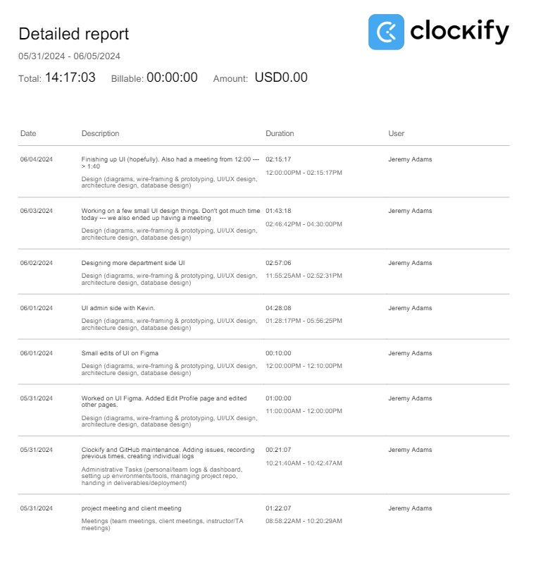
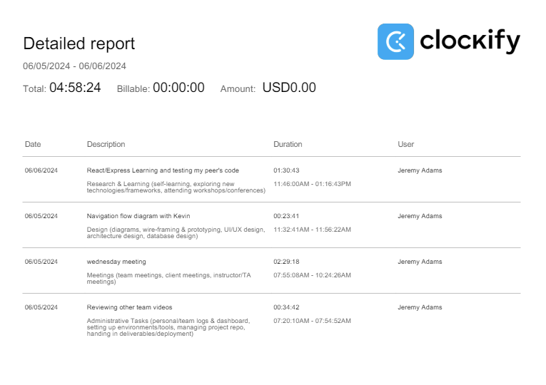

# Week 4

## Wednesday (6/5/2024)

### Timesheet

### Current Tasks
  * #1: Add UI to the design doc
  * #2: Record portion of video
  * #3: Start writing more tests

### Progress Update (since 5/31/2024)
<table>
    <tr>
        <td><strong>TASK/ISSUE #</strong>
        </td>
        <td><strong>STATUS</strong>
        </td>
    </tr>
    <tr>
        <!-- Task/Issue # -->
        <td>Design UI for site
        </td>
        <!-- Status -->
        <td>Complete
        </td>
    </tr>
    
</table>

### Weekly Goal Review
Kevin and I completed the UI design for our entire site. (instructor side, department side, and admin side)

### Next Cycle Goals
  * Finish the design document
  * Create the design video

<!--------------------------------------------------------------------------------------------------------------------------------------------------------------------------------------------->
## Friday (6/7/2024)

### Timesheet

### Current Tasks
  * #1: Record my part for video
  * #2: Start writing tests
  * #3: Start developing frontend of site
  * #4: Learn more about React and Express

### Progress Update (since 6/5/2024)
<table>
    <tr>
        <td><strong>TASK/ISSUE #</strong>
        </td>
        <td><strong>STATUS</strong>
        </td>
    </tr>
    <tr>
        <!-- Task/Issue # -->
        <td>Add UI to Design Doc
        </td>
        <!-- Status -->
        <td>Complete
        </td>
    </tr>
    <tr>
        <!-- Task/Issue # -->
        <td>Finish Design Doc 
        </td>
        <!-- Status -->
        <td>Complete
        </td>
    </tr>
    <tr>
        <!-- Task/Issue # -->
        <td>Record portion of video
        </td>
        <!-- Status -->
        <td>In progress
        </td>
    </tr>
    <tr>
        <!-- Task/Issue # -->
        <td>Start writing more tests
        </td>
        <!-- Status -->
        <td>Haven't started
        </td>
    </tr>
</table>

### Weekly Goal Review
Kevin and I created flowchart diagrams for the UI of the site, one for the instructor view and one for the department view. 
I haven't yet recorded my video but I will do that after the meeting on Friday.
I've also been steadily learning about React and how to begin writing tests and actually developing the site.

### Next Cycle Goals
  * Have 10 features (2 per person) complete before next Friday
  * Attain good profiency with React
  * Write some tests
  * Help everyone in my team be successful
