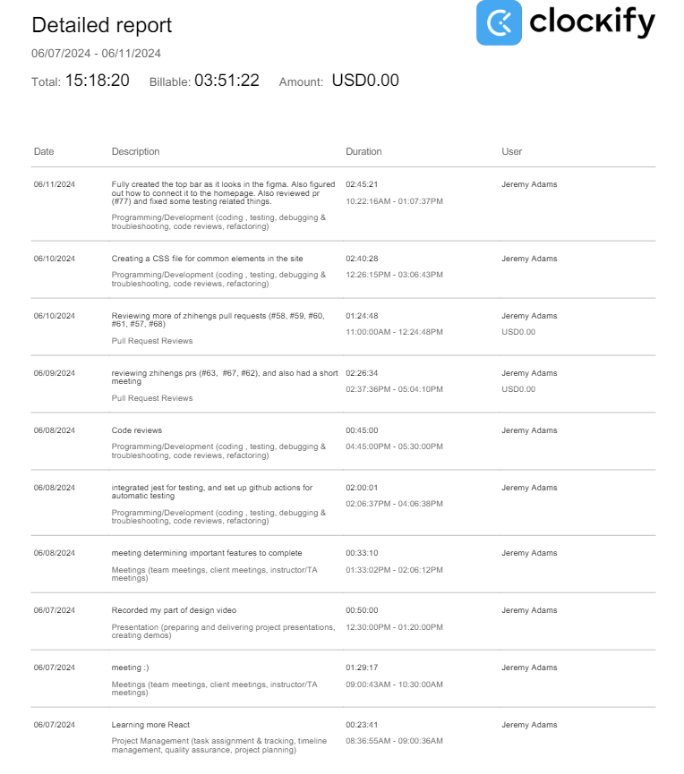

# Week 5

## Wednesday (06/12/2024)

### Timesheet

### Current Tasks
  * #1: Write some tests for the common CSS related things (sidebar, topbar, commonCSS.js)
  * #2: Start working on the login page frontend
  * #3: Start creating the data entry page frontend

### Progress Update (since 06/07/2024)
<table>
    <tr>
        <td><strong>TASK/ISSUE #</strong>
        </td>
        <td><strong>STATUS</strong>
        </td>
    </tr>
    <tr>
        <!-- Task/Issue # -->
        <td>Record my part for the design video
        </td>
        <!-- Status -->
        <td>Complete
        </td>
    </tr>
    <tr>
        <!-- Task/Issue # -->
        <td>Start writing tests
        </td>
        <!-- Status -->
        <td>Complete
        </td>
    </tr>
    <tr>
        <!-- Task/Issue # -->
        <td>Start developing frontend of site
        </td>
        <!-- Status -->
        <td>Complete
        </td>
    </tr>
    <tr>
        <!-- Task/Issue # -->
        <td>Learn more about react and express
        </td>
        <!-- Status -->
        <td>Complete
        </td>
    </tr>
    
</table>

### Weekly Goal Review
Overall we made a lot of progress on the project. I integrated GitHub actions and created some test jest tests. I refactored the code and created common js files with the sidebar (Kevin created) and topbar (which I created) that can be imported by any page. I also put in a lot of time reviewing other people's code.

### Next Cycle Goals
  * Finish the login page
  * Write at least 1 actual test that tests if an aspect of the site is working

<!--------------------------------------------------------------------------------------------------------------------------------------------------------------------------------------------->
## Friday (06/14/2024)
