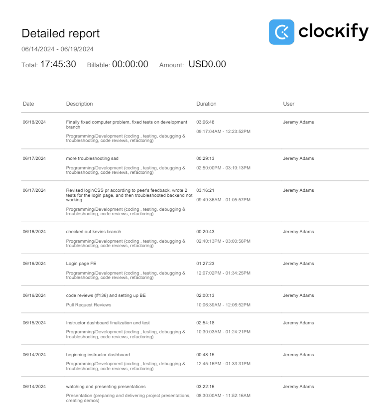
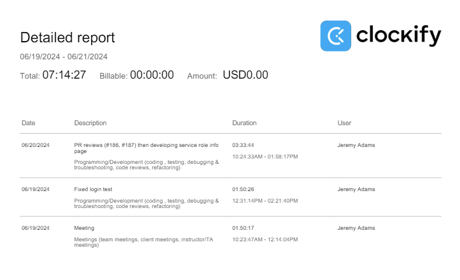

# Week 6

## Wednesday (06/19/2024)

### Timesheet

### Current Tasks
  * #1: Write some tests for the common CSS related things (sidebar, topbar, commonCSS.js)
  * #2: Start working on the login page frontend
  * #3: Start creating the data entry page frontend

### Progress Update (since 06/14/2024)
<table>
    <tr>
        <td><strong>TASK/ISSUE #</strong>
        </td>
        <td><strong>STATUS</strong>
        </td>
    </tr>
    <tr>
        <!-- Task/Issue # -->
        <td>Trying to fix an error involving front end tests
        </td>
        <!-- Status -->
        <td>Complete?/Worked around
        </td>
    </tr>
    <tr>
        <!-- Task/Issue # -->
        <td>Write some tests for the common CSS related things (sidebar, topbar, commonCSS.js)
        </td>
        <!-- Status -->
        <td>Incomplete
        </td>
    </tr>
    <tr>
        <!-- Task/Issue # -->
        <td>Start working on the login page frontend
        </td>
        <!-- Status -->
        <td>Complete
        </td>
    </tr>
    <tr>
        <!-- Task/Issue # -->
        <td>Work on FE for other pages that haven't been worked on yet (dashboard)
        </td>
        <!-- Status -->
        <td>Complete
        </td>
    </tr>
    
</table>

### Cycle Goal Review
This week was difficult because I was dealing with technical difficulties that prevented me from starting the backend. Luckily I figured it out today (June-18) and I can start having a much more streamlined
development process. Despite the issues, however, I was still able to get done quite a lot. I worked on the front end for the login page and the dashboard, and also figured out more about tests and wrote good tests
for both those pages.

### Next Cycle Goals
  * Continue working on the front end for various pages in the MVP (Edit profile, service role info, data entry, + more?)
  * Make sure to write tests for those pages, and also write some for other pages if my teammates don't end up doing it

<!--------------------------------------------------------------------------------------------------------------------------------------------------------------------------------------------->
## Friday (06/21/2024)

### Timesheet

### Current Tasks
  * #1: Continue working on the Role Information page
  * #2: Start working on the Course Information page
  * #3: Start working on the Data Entry page

### Progress Update (since 06/19/2024)
<table>
    <tr>
        <td><strong>TASK/ISSUE #</strong>
        </td>
        <td><strong>STATUS</strong>
        </td>
    </tr>
    <tr>
        <!-- Task/Issue # -->
        <td>Fix error involving the login test
        </td>
        <!-- Status -->
        <td>Complete
        </td>
    </tr>
    <tr>
        <!-- Task/Issue # -->
        <td>Finish the role info page
        </td>
        <!-- Status -->
        <td>In Progress
        </td>
    </tr>
    <tr>
        <!-- Task/Issue # -->
        <td>Finish the course info page
        </td>
        <!-- Status -->
        <td>Incomplete
        </td>
    </tr>
    <tr>
        <!-- Task/Issue # -->
        <td>Finish the data entry page
        </td>
        <!-- Status -->
        <td>Incomplete
        </td>
    </tr>

    
</table>

### Cycle Goal Review
This cycle went very successfuly for me. On wednesday I fixed a pesky error that was causing the tests to fail, and today (thursday) I made a lot of progress on the Service Role Information page.

### Next Cycle Goals
  * Complete the service role info page
  * Complete all other pages assigned to me (Course Info, data entry)
  * Ensure all pages are properly tested
