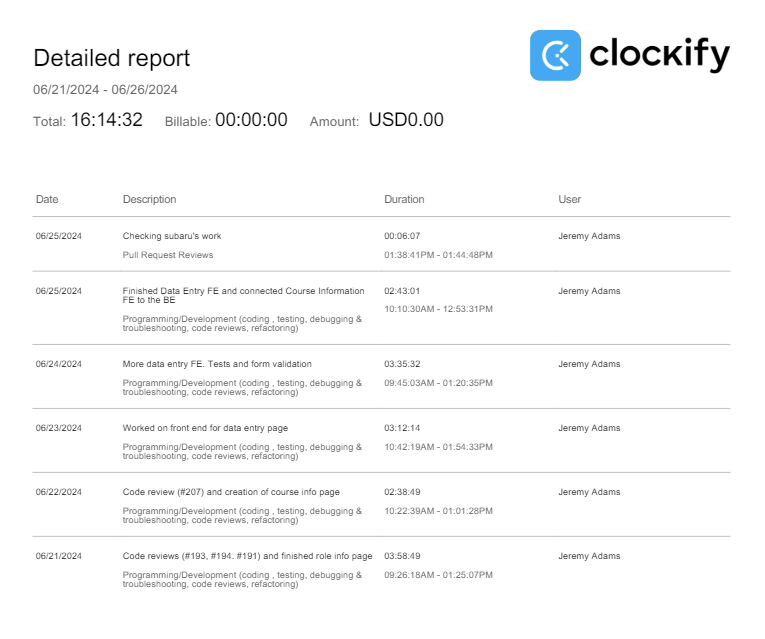

# Week 6

## Wednesday (06/26/2024)

### Timesheet

### Current Tasks
  * #1: Fix the css Kevin told me about
  * #2: Start working on the assign professors modal

### Progress Update (since 06/21/2024)
<table>
    <tr>
        <td><strong>TASK/ISSUE #</strong>
        </td>
        <td><strong>STATUS</strong>
        </td>
    </tr>
    <tr>
        <!-- Task/Issue # -->
        <td>Finish the role info page
        </td>
        <!-- Status -->
        <td>Complete
        </td>
    </tr>
    <tr>
        <!-- Task/Issue # -->
        <td>Finish the course info page
        </td>
        <!-- Status -->
        <td>Complete
        </td>
    </tr>
    <tr>
        <!-- Task/Issue # -->
        <td>Finish the data entry page
        </td>
        <!-- Status -->
        <td>Complete
        </td>
    </tr>
</table>

### Cycle Goal Review
This past cycle has been very productive. I completed the front end for 3 different pages, and connected one of them to the backend. I also wrote tests for each page. 
I think the overall progress of the project has been really good.

### Next Cycle Goals
  * Finish the assign professors modal

<!--------------------------------------------------------------------------------------------------------------------------------------------------------------------------------------------->
## Friday (06/28/2024)

