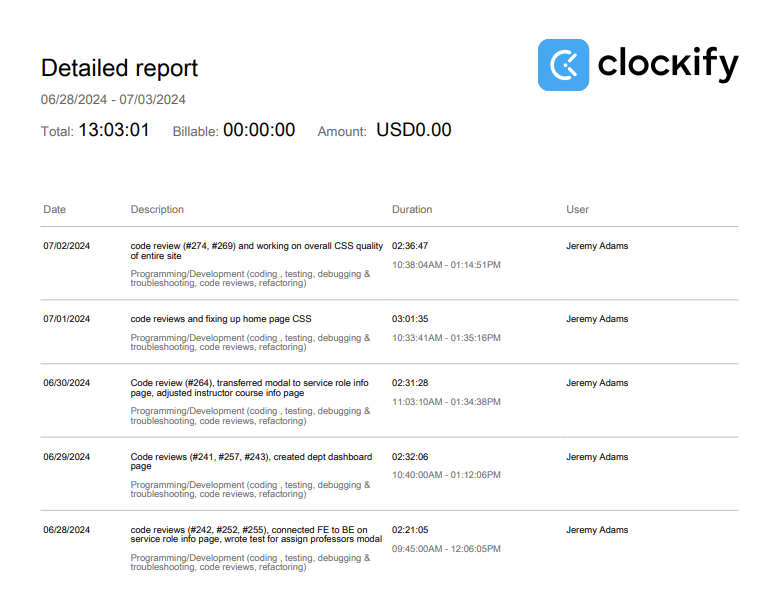
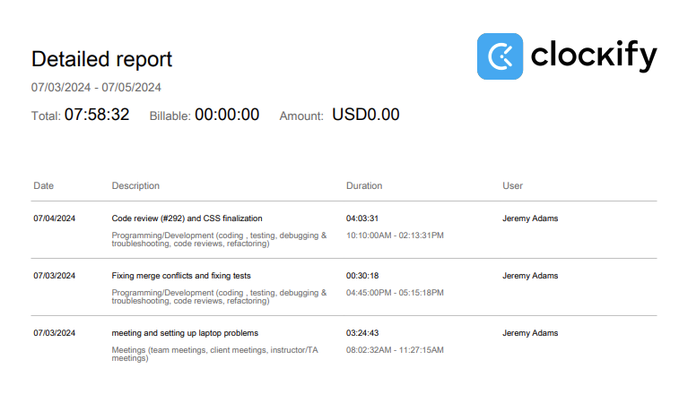

# Week 8

## Wednesday (07/03/2024)

### Timesheet

### Current Tasks
  * #1: Finalize CSS for all pages in MVP
  * #2: Create the edit course and edit service role pages

### Progress Update (since 06/28/2024)
<table>
    <tr>
        <td><strong>TASK/ISSUE #</strong>
        </td>
        <td><strong>STATUS</strong>
        </td>
    </tr>
    <tr>
        <!-- Task/Issue # -->
        <td>Test the assign professors modal
        </td>
        <!-- Status -->
        <td>Complete
        </td>
    </tr>
    <tr>
        <!-- Task/Issue # -->
        <td>Transfer the assign professors modal to the service role info page
        </td>
        <!-- Status -->
        <td>Complete
        </td>
    </tr>
    <tr>
        <!-- Task/Issue # -->
        <td>Do the department dashboard page
        </td>
        <!-- Status -->
        <td>Complete
        </td>
    </tr>
</table>

### Cycle Goal Review
This cycle was very productive. Compared to last time, I didn't have quite as much to do, but I still think I accomplished a lot and managed my time effectively. Overall the MVP is basically done, and I think we're doing a great job staying on track.

### Next Cycle Goals
  * Finalize the CSS for the MVP

<!--------------------------------------------------------------------------------------------------------------------------------------------------------------------------------------------->
## Friday (06/05/2024)

### Timesheet

### Current Tasks
  * #1: Mentally prepare for MVP presentation
  * #2: Fix the CSS that still isn't working
  * #3: Begin working on the Edit Service Role page
    

### Progress Update (since 07/03/2024)
<table>
    <tr>
        <td><strong>TASK/ISSUE #</strong>
        </td>
        <td><strong>STATUS</strong>
        </td>
    </tr>
    <tr>
        <!-- Task/Issue # -->
        <td>Finalize the CSS for all MVP pages
        </td>
        <!-- Status -->
        <td>Complete
        </td>
    </tr>
    <tr>
        <!-- Task/Issue # -->
        <td>Create the edit course and edit service role pages
        </td>
        <!-- Status -->
        <td>Incomplete
        </td>
    </tr>

### Cycle Goal Review
This mini-cycle was very successful. On Wednesday we had a meeting discussing what we all need to do before Friday, and then we got to it. I reviewed a lot of PR's and corrected a lot of the 
CSS problems in the site. I also had to set up the new laptop I'm using so it can run the project.

### Next Cycle Goals
  * Do the edit course and edit service role pages
  * Fix the remaining CSS issues (top bar being weird, icons being weird)

