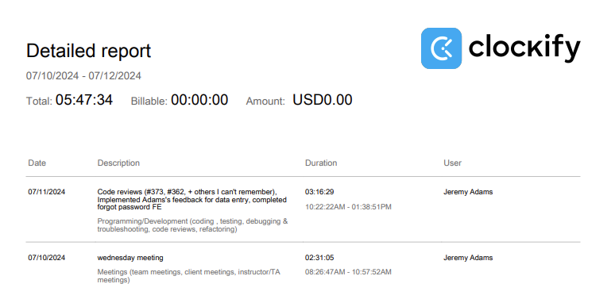

# Week 9

## Wednesday (07/10/2024)

### Timesheet

### Current Tasks
  * #1: Front end for Forgot Password pages
  * #2: Front end for edit service role and edit course
  * #3: Front end for instructor service role info

### Progress Update (since 07/05/2024)
<table>
    <tr>
        <td><strong>TASK/ISSUE #</strong>
        </td>
        <td><strong>STATUS</strong>
        </td>
    </tr>
    <tr>
        <!-- Task/Issue # -->
        <td>Mentally prepare for MVP presentation
        </td>
        <!-- Status -->
        <td>Complete
        </td>
    </tr>
    <tr>
        <!-- Task/Issue # -->
        <td>Fix CSS bugs
        </td>
        <!-- Status -->
        <td>Complete
        </td>
    </tr>
    <tr>
        <!-- Task/Issue # -->
        <td>Begin working on the edit service role page
        </td>
        <!-- Status -->
        <td>Incomplete
        </td>
    </tr>
</table>

### Cycle Goal Review
This cycle was very productive. I feel like we did a really good job figuring out what everyone needs to work on almost directly after our MVP presentation.
I think I've made a good amount of progress on my tasks, despite some technical difficulties with my computer. I also did a good job staying on top of all the PR's
and reviewing them ASAP.

### Next Cycle Goals
  * Finish the forgot password pages
  * Begin working on one of the edit pages

<!--------------------------------------------------------------------------------------------------------------------------------------------------------------------------------------------->
## Friday (07/12/2024)

### Timesheet

### Current Tasks
  * #1: Finish reset password FE
  * #2: Do department edit profile FE
    

### Progress Update (since 07/05/2024)
<table>
    <tr>
        <td><strong>TASK/ISSUE #</strong>
        </td>
        <td><strong>STATUS</strong>
        </td>
    </tr>
    <tr>
        <!-- Task/Issue # -->
        <td>Front end for forgot password page
        </td>
        <!-- Status -->
        <td>Complete
        </td>
    </tr>
    <tr>
        <!-- Task/Issue # -->
        <td>Front end for instructor service role info
        </td>
        <!-- Status -->
        <td>Incomplete
        </td>
    </tr>
</table>

### Cycle Goal Review
This mini-cycle I made steady progress on my tasks. Some of our tasks were switched around since last report so that's why it's a little different. I
finished the reset password page, and also made some more changes to the data entry page that Adams suggested. I think know it's completely finished which is nice. Overall, I think we've reached a point where as a team we're very familiar with both the frontend and backend and have a good idea of how they connect together. Because of this there's been a lot less problems in that area and we all just know what to do without needing to ask eachother, and progress has been much more stable.

### Next Cycle Goals
  * Finish the reset password page
  * Do department edit profile FE
  * Do instructor service role info
  * Go back to my old tests and make them up to quality

