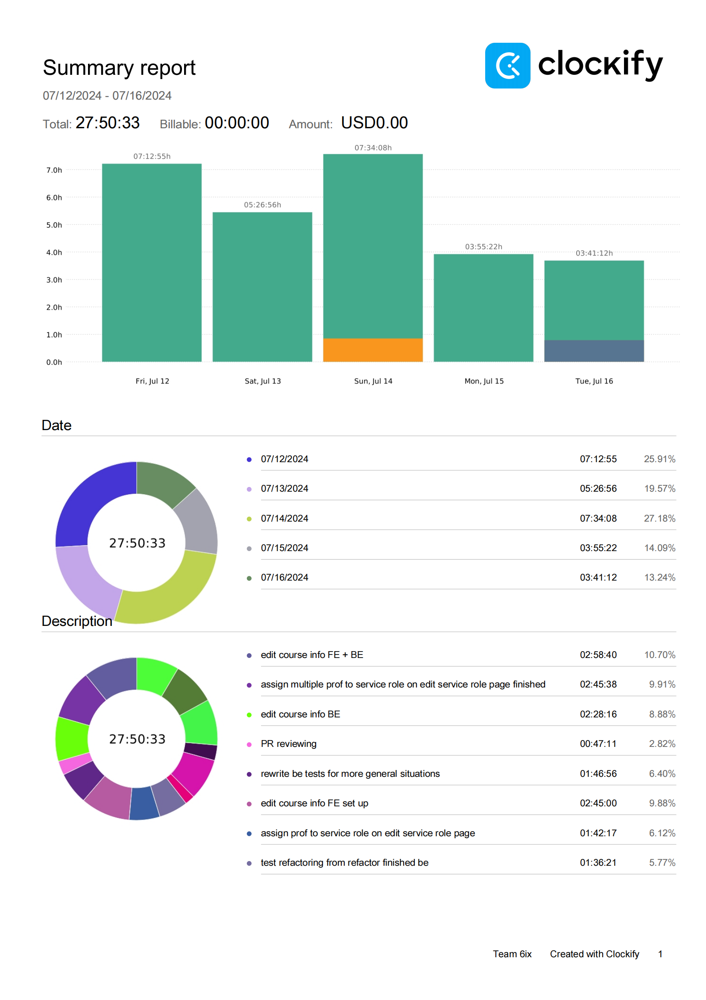
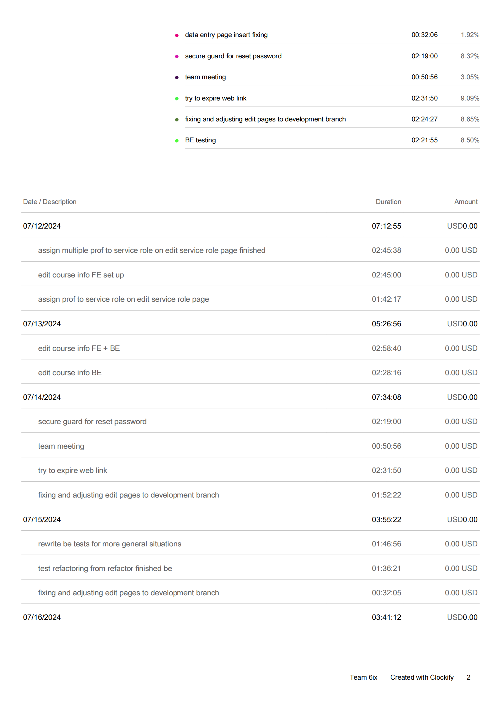
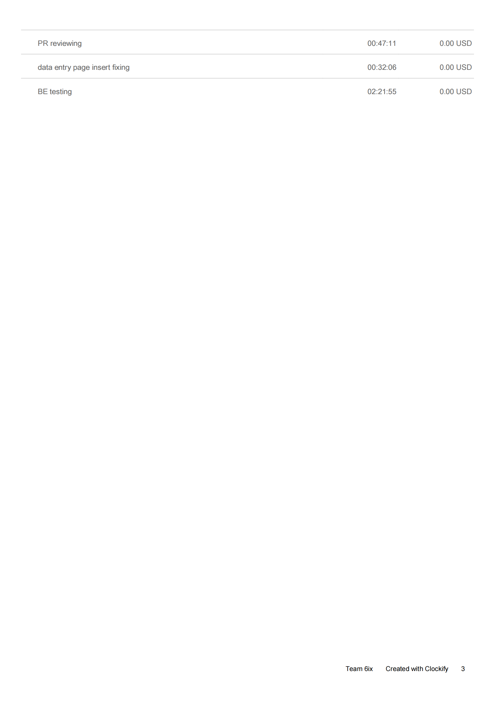
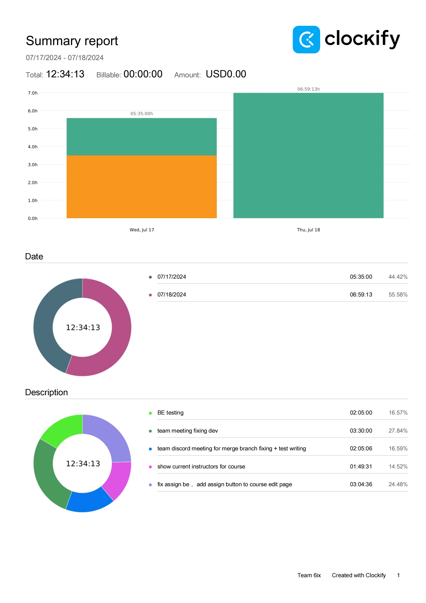
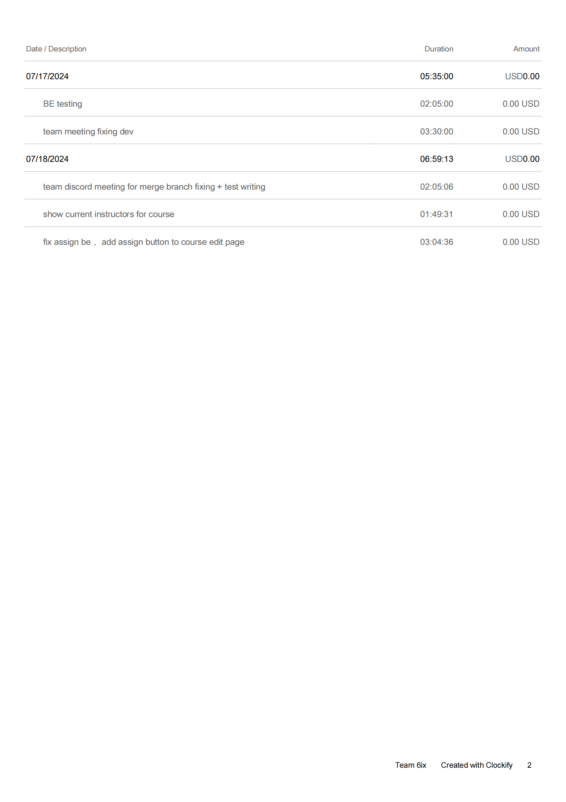

## Wednesday (7/17/2024)

### Timesheet

### Current Tasks
  * #1: Testing BE functions 

### Progress Update (since 6/21/2024)
<table>
    <tr>
        <td><strong>TASK/ISSUE #</strong>
        </td>
        <td><strong>STATUS</strong>
        </td>
    </tr>
    <tr>
        <!-- Task/Issue # -->
        <td> Write Tests for Re-fatctor Finished BE parts
        </td>
        <!-- Status -->
        <td> Finished * 6
        </td>
    </tr>   
</table>

### Weekly Goal Review
  *  Finished and completed fixing conflicts for previous work. FE + BE for both edit page is finished, merge conflict to base branch solved.
  *  Test files for already finished re-factored BE functions start. Re-factor to test with random data to match with more general cases and less re-striction.

### Next Cycle Goals
  * Finish up all BE tests and re-factor.

<!--------------------------------------------------------------------------------------------------------------------------------------------------------------------------------------------->
## Friday (7/19/2024)

### Timesheet

### Current Tasks
  * #1: Fixing edit pages function for assign person
  * #2: Writing tests for re-factored code

### Progress Update (since 7/12/2024)
<table>
    <tr>
        <td><strong>TASK/ISSUE #</strong>
        </td>
        <td><strong>STATUS</strong>
        </td>
    </tr>
    <tr>
        <!-- Task/Issue # -->
        <td> Edit page assign instructor modal
        </td>
        <!-- Status -->
        <td> finish
          </td>
    </tr>
 <tr>
        <!-- Task/Issue # -->
        <td> Write tests for re-factor finished BE functions
        </td>
        <!-- Status -->
        <td> finish * 10
          </td>
    </tr>
</table>

### Weekly Goal Review

Work for department page edit information pages are mainly finished. Backend tests for re-factored finished part is also completed.

Team meeting make new request to add a remove function under department course, would probaly finish before weekend and continue writing tests for new re-factored BE code.

### Next Cycle Goals
  * Goal 1 Finish all tests for BE re-factored code (if all BE re-refactored then I'll finish all BE tests)
  * Goal 2 Remove function for edit page.
