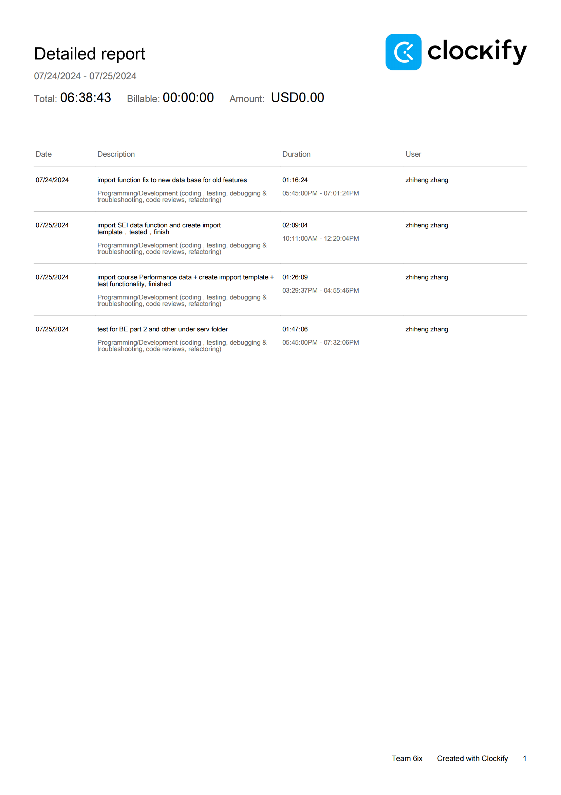

Week 11

## Wednesday (7/24/2024)

### Timesheet

### Current Tasks
  * #1: Documentation for project
  * #2: BE testing

### Progress Update (since 5/31/2024)
<table>
    <tr>
        <td><strong>TASK/ISSUE #</strong>
        </td>
        <td><strong>STATUS</strong>
        </td>
    </tr>
    <tr>
        <!-- Task/Issue # -->
        <td> Documentation
        </td>
        <!-- Status -->
        <td> In progress
        </td>
    </tr>
  <tr>
        <!-- Task/Issue # -->
        <td> New Imprt function for course assign
        </td>
        <!-- Status -->
        <td> Finish
        </td>
    </tr><tr>
        <!-- Task/Issue # -->
        <td> New Imprt function for service role assign
        </td>
        <!-- Status -->
        <td> Finish
        </td>
    </tr>
    
</table>

### Weekly Goal Review

Finished new import functions for uploading course teaching assignment and service role assignment.

BE refactor doesn't have much new update because of changes decided on team meetings so I am currently doing documentation for the project.

### Next Cycle Goals
  * BE Testing
  * Documentation

<!--------------------------------------------------------------------------------------------------------------------------------------------------------------------------------------------->
## Friday (7/26/2024)

### Timesheet

### Current Tasks
  * #1: 
  * #2: 

### Progress Update (since 7/24/2024)
<table>
    <tr>
        <td><strong>TASK/ISSUE #</strong>
        </td>
        <td><strong>STATUS</strong>
        </td>
    </tr>
    <tr>
        <!-- Task/Issue # -->
        <td> new import for SEI data </td>
        <!-- Status -->
        <td> finish </td>
    </tr>
    <tr>
        <!-- Task/Issue # -->
        <td> new import for course performance </td>
        <!-- Status -->
        <td> finish </td>
    </tr>
    <tr>
        <!-- Task/Issue # -->
        <td> fix old import functions to new database </td>
        <!-- Status -->
        <td> finish </td>
    </tr>
 <tr>
        <!-- Task/Issue # -->
        <td> tests (BE) for refactor part 2 </td>
        <!-- Status -->
        <td> finish </td>
    </tr>
</table>

### Weekly Goal Review

Tests for refactored part 2 is finished, other code test would be start ahead but not checking query call-up time so should allow more freedom for refactoring. New import functions pointed out on discord is finished, and due to some changes to the database design, some changes to the previous imports are also required and finished.

### Next Cycle Goals
  * Goal 1 BE all test under service folder
  * Goal 2? Integration test
