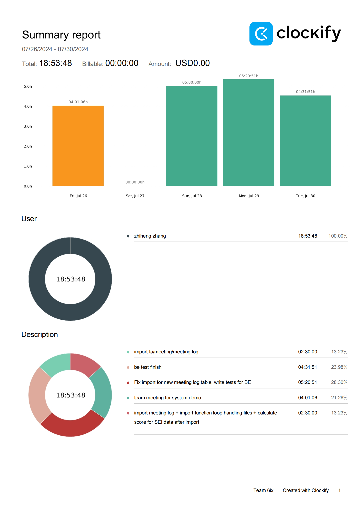
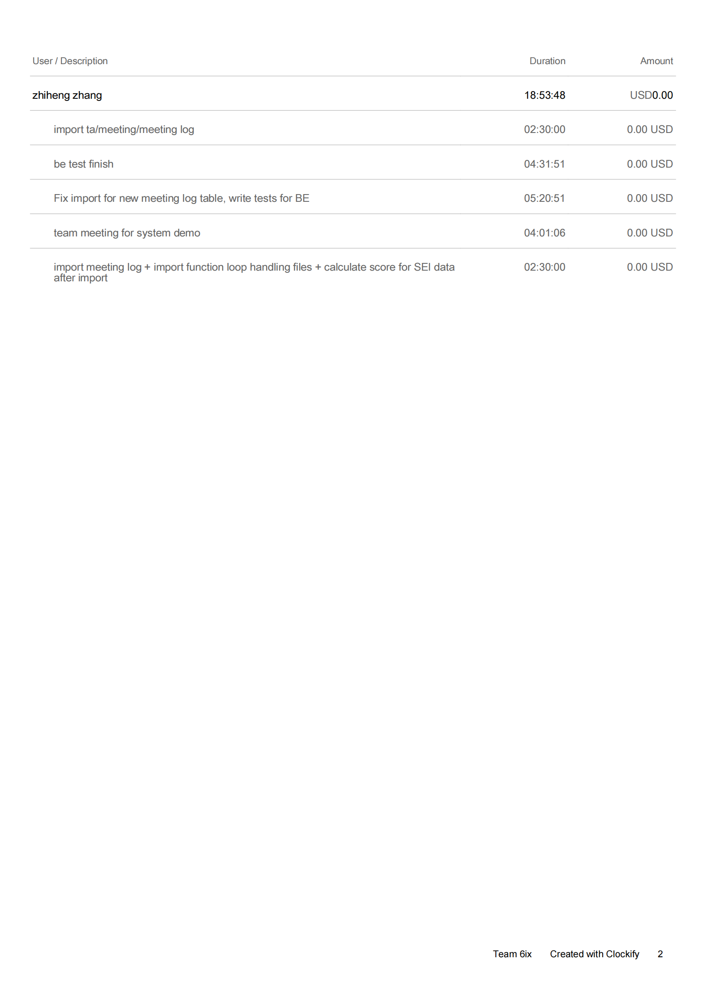

Week 12

## Wednesday (7/31/2024)

### Timesheet

### Current Tasks
  * #1: BE testing Final round

### Progress Update (since 7/26/2024)
<table>
    <tr>
        <td><strong>TASK/ISSUE #</strong>
        </td>
        <td><strong>STATUS</strong>
        </td>
    </tr>
    <tr>
        <!-- Task/Issue # -->
        <td> Documentation
        </td>
        <!-- Status -->
        <td> In progress
        </td>
    </tr>
  <tr>
        <!-- Task/Issue # -->
        <td> Fix import
        </td>
        <!-- Status -->
        <td> Finish
        </td>
    </tr><tr>
        <!-- Task/Issue # -->
        <td> BE Tests
        </td>
        <!-- Status -->
        <td> Finish
        </td>
    </tr>
    
</table>

### Weekly Goal Review

Fixed old import functions for uploading multiple files at the same time success.(Error before if upload to something not created. )

BE Tests finish for all refactored, non-refactored are also uploaded but avoided strictly checking call up querys.

### Next Cycle Goals
  * Final round trouble shooting
  * Preparing for final testing
  * Documentation
