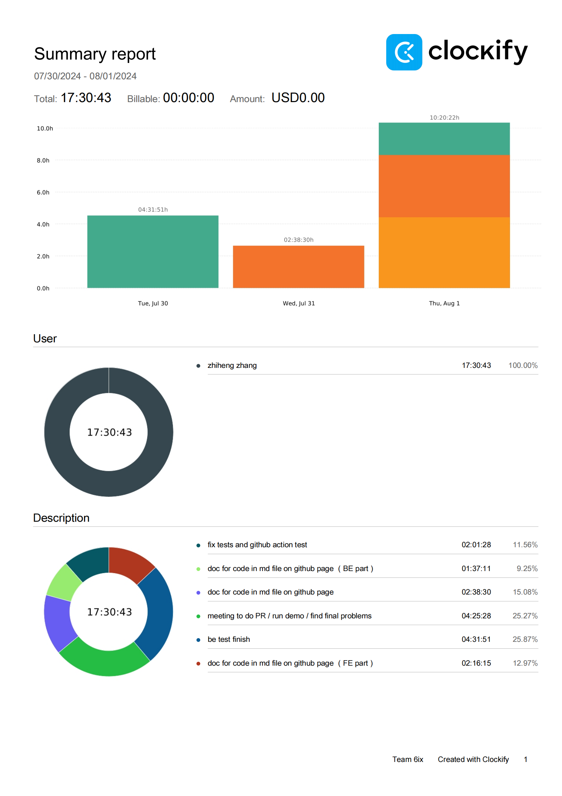
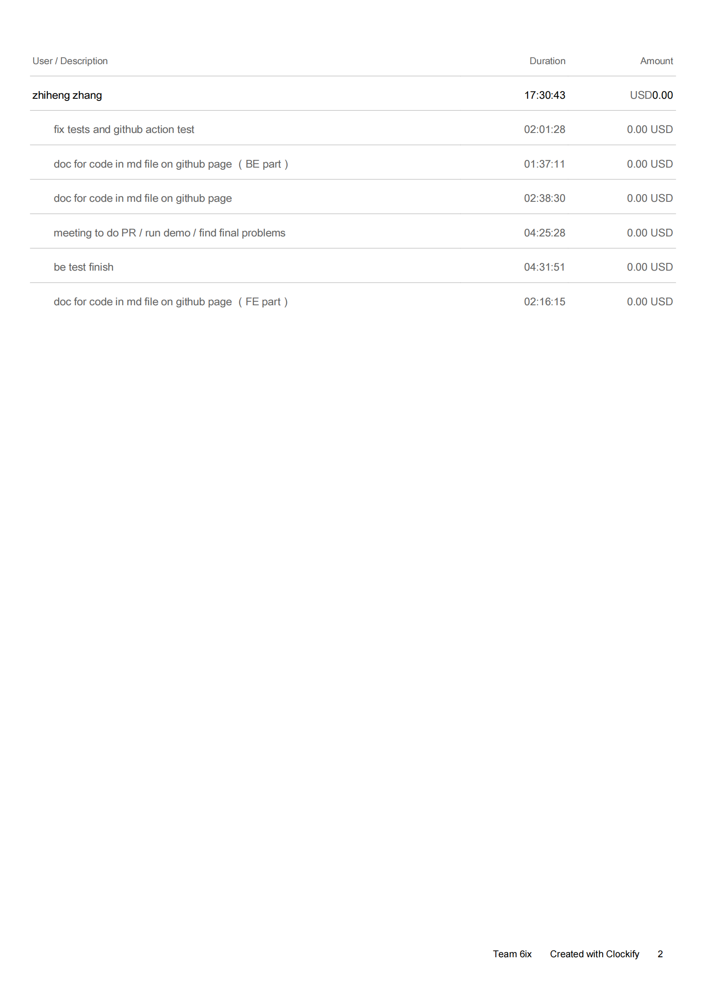

Week 12

## Wednesday (7/31/2024)

### Timesheet

### Current Tasks
  * #1: BE testing Final round

### Progress Update (since 7/26/2024)
<table>
    <tr>
        <td><strong>TASK/ISSUE #</strong>
        </td>
        <td><strong>STATUS</strong>
        </td>
    </tr>
    <tr>
        <!-- Task/Issue # -->
        <td> Documentation
        </td>
        <!-- Status -->
        <td> In progress
        </td>
    </tr>
  <tr>
        <!-- Task/Issue # -->
        <td> Fix import
        </td>
        <!-- Status -->
        <td> Finish
        </td>
    </tr><tr>
        <!-- Task/Issue # -->
        <td> BE Tests
        </td>
        <!-- Status -->
        <td> Finish
        </td>
    </tr>
    
</table>

### Weekly Goal Review

Fixed old import functions for uploading multiple files at the same time success.(Error before if upload to something not created. )

BE Tests finish for all refactored, non-refactored are also uploaded but avoided strictly checking call up querys.

### Next Cycle Goals
  * Final round trouble shooting
  * Preparing for final testing
  * Documentation

## Friday (8/02/2024)

### Timesheet

### Current Tasks
  * #1: .md doc to explain code

### Progress Update (since 7/31/2024)
<table>
    <tr>
        <td><strong>TASK/ISSUE #</strong>
        </td>
        <td><strong>STATUS</strong>
        </td>
    </tr>
    <tr>
        <!-- Task/Issue # -->
        <td> .md Documentation FE
        </td>
        <!-- Status -->
        <td> In progress
        </td>
    </tr>
  <tr>
        <!-- Task/Issue # -->
        <td> .md Documentation BE
        </td>
        <!-- Status -->
        <td> Finish
        </td>
    </tr>
 <tr>
        <!-- Task/Issue # -->
        <td> Fix BE Tests
        </td>
        <!-- Status -->
        <td> Finish
        </td>
    </tr>
    <tr>
        <!-- Task/Issue # -->
        <td> Fix BE Code based on test
        </td>
        <!-- Status -->
        <td> Finish
        </td>
    </tr>
    
</table>

### Weekly Goal Review

Fixed BE test and code so the code matches with the test required content.

BE .md file to explain the code functionality is finished, start on FE part.

### Next Cycle Goals
  * Finish FE .md file
  * Re-draw diagrams for project
  * Start report writing
