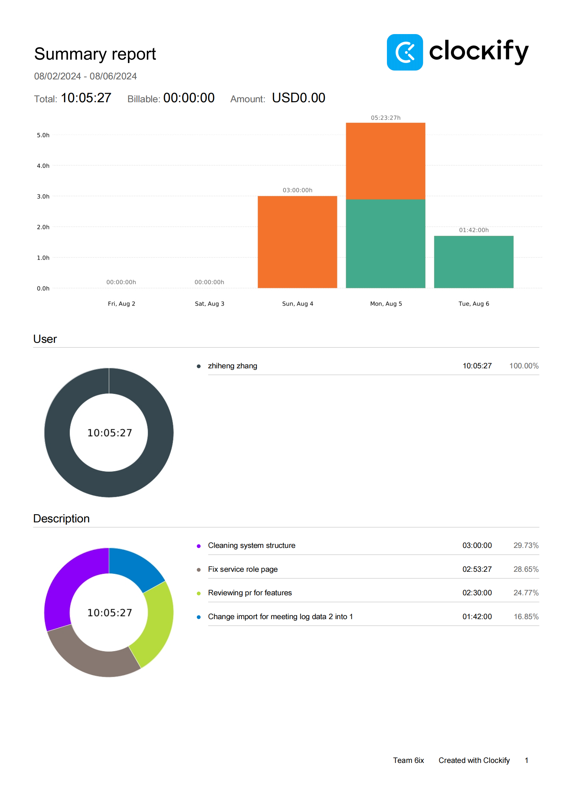
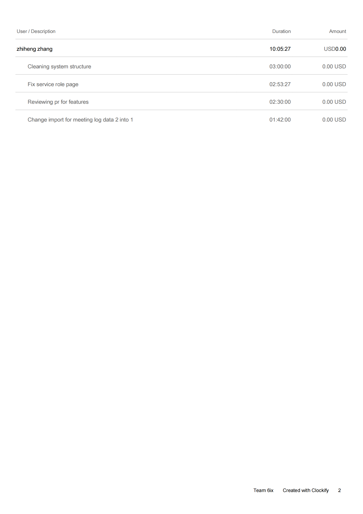
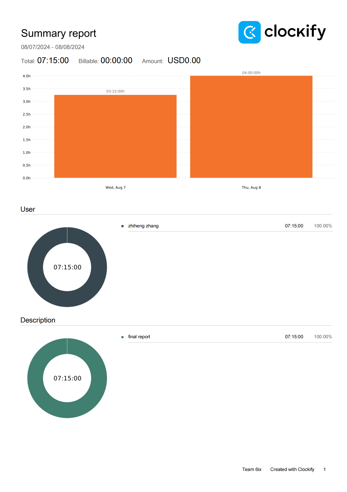
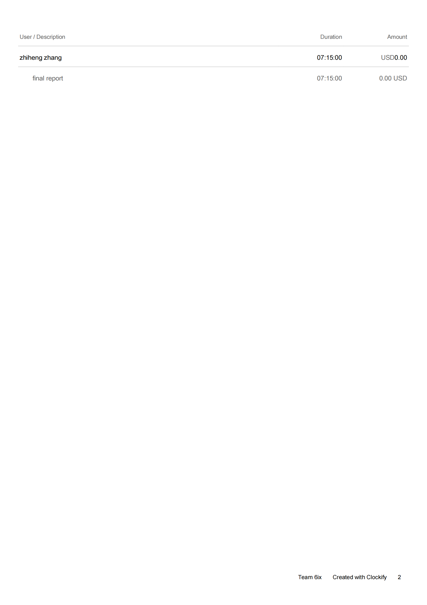

Week 13

## Wednesday (8/07/2024)

### Timesheet

### Current Tasks
  * #1: Almost done programming, some fixing/improving after every demo running
  * #2: Report writing

### Progress Update (since 7/31/2024)
<table>
    <tr>
        <td><strong>TASK/ISSUE #</strong>
        </td>
        <td><strong>STATUS</strong>
        </td>
    </tr>
    <tr>
        <!-- Task/Issue # -->
        <td> Programming
        </td>
        <!-- Status -->
        <td> Almost done
        </td>
    </tr>
  <tr>
        <!-- Task/Issue # -->
        <td> Report
        </td>
        <!-- Status -->
        <td> In progress
        </td>
    </tr>
    
</table>

### Weekly Goal Review

Almost done with the programming part with this project, some coding work still left because when demo running our system we find new stuff to make better user experience.

Report writing is started, now cleanning up the content and can get the first draft in 1-2 days. The draft may need another 1-2 round of improve to get final version.

### Next Cycle Goals
  * Finish report
  * Finish project

## Friday (8/09/2024)

### Timesheet

### Current Tasks
  * #1:

### Progress Update (since 8/07/2024)
<table>
    <tr>
        <td><strong>TASK/ISSUE #</strong>
        </td>
        <td><strong>STATUS</strong>
        </td>
    </tr>
    <tr>
        <!-- Task/Issue # -->
        <td> Report
        </td>
        <!-- Status -->
        <td> Finish
        </td>
    </tr>
</table>

### Weekly Goal Review

Everything is finished, clear up the project for final presentation.

### Next Cycle Goals
  * Peer report evaluation and Holiday.
