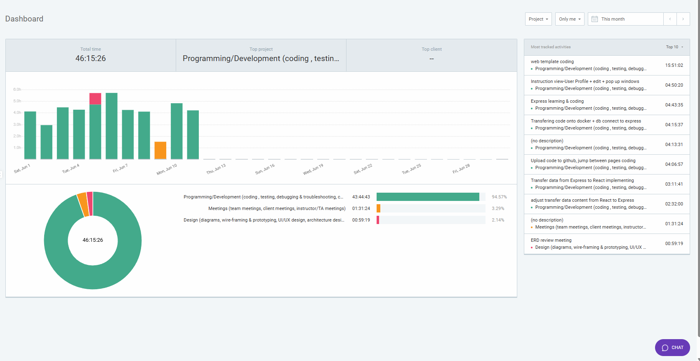
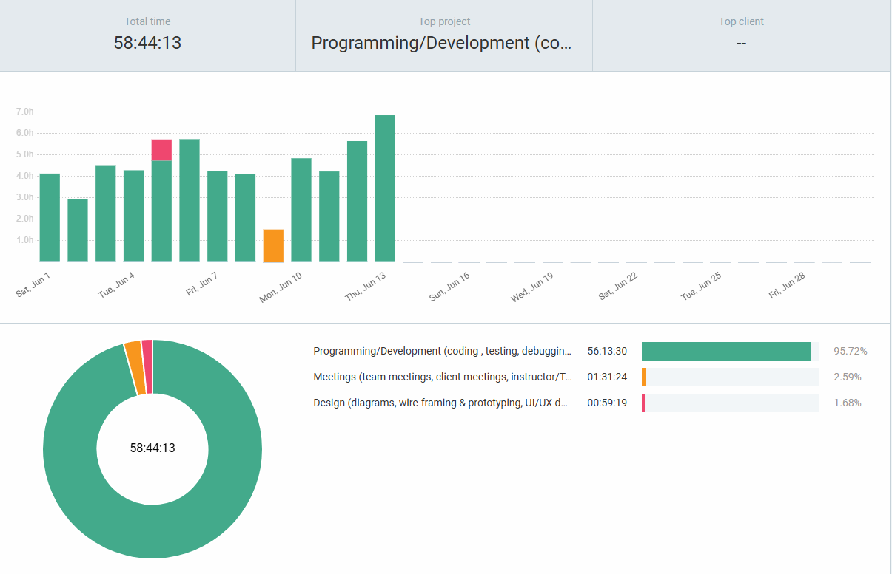

# Week 5

## Wednesday (6/12/2024)

### Timesheet

### Current Tasks
  * #1: Continue front end web-page template coding
  * #2: Pop-up windows when buttons clicked
  * #3: Page connection between front end

### Progress Update (since 6/07/2024)
<table>
    <tr>
        <td><strong>TASK/ISSUE #</strong>
        </td>
        <td><strong>STATUS</strong>
        </td>
    </tr>
    <tr>
        <!-- Task/Issue # -->
        <td>Front End Template Coding
        </td>
        <!-- Status -->
        <td>All pages finished
        </td>
    </tr>   
</table>

### Weekly Goal Review
Finished the Reactt front-end coding for all pages, some components are required to be added later.

Code is template only for Kevin and Jermy to work on as quick start up template, refine/more component/connection between pages required.

Sub-window pop-up is realized for all pages, UI may need adjustment but reqirement is completed.

Connection between pages is done, not all pages is connected because they are either being adjusted to match UI or the connecting process haven't reach them yet.

### Next Cycle Goals
  * Checking authentication part
  * Checking data import and outport (Back end)
  * Adjust UI design (TBD)

<!--------------------------------------------------------------------------------------------------------------------------------------------------------------------------------------------->
## Friday (6/14/2024)

### Timesheet

### Current Tasks
  * #1: Task 1 Log in with setted multiple account and password

### Progress Update (since 6/5/2024)
<table>
    <tr>
        <td><strong>TASK/ISSUE #</strong>
        </td>
        <td><strong>STATUS</strong>
        </td>
    </tr>
    <tr>
        <!-- Task/Issue # -->
        <td>Back end login</td>
        <!-- Status -->
        <td>part finished</td>
    </tr>
    <tr>
        <!-- Task/Issue # -->
        <td>Authentication</td>
        <!-- Status -->
        <td>In Progress</td>
    </tr>
</table>

### Weekly Goal Review

Log in function is partially finished, but need add up to allow multiple accounts log in. Currently it only allows the first account in stored json the log in.

### Next Cycle Goals
  * Goal 1 Allow multiple accounts log in the system
  * Goal 2 Have account type check after all accounts can log in so can navigate to different board.
