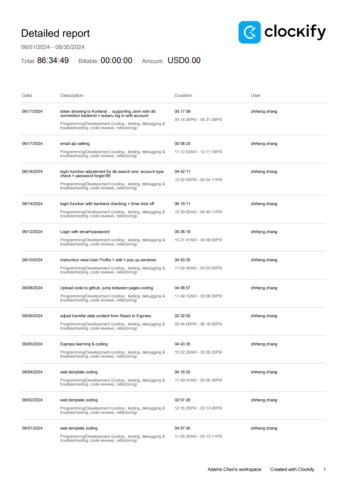
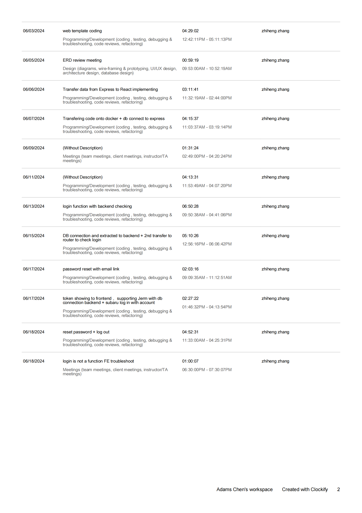

## Wednesday (6/19/2024)

### Timesheet

### Current Tasks
  * #1: Log out + deacive authentication 
  * #2: encrypt password 

### Progress Update (since 6/14/2024)
<table>
    <tr>
        <td><strong>TASK/ISSUE #</strong>
        </td>
        <td><strong>STATUS</strong>
        </td>
    </tr>
    <tr>
        <!-- Task/Issue # -->
        <td>Log in with authentication
        </td>
        <!-- Status -->
        <td>Finished
        </td>
    </tr>   
</table>

### Weekly Goal Review

Authentication log in finished. Support on trouble shooting for front-end require token and other features.

Explaining code and logic for guiding front end setting up proper request to backend to ask for target data.

### Next Cycle Goals
  * log out function
  * make password encryped
  * course history page BE

<!--------------------------------------------------------------------------------------------------------------------------------------------------------------------------------------------->
## Friday (6/21/2024)

### Timesheet

### Current Tasks
  * #1: 

### Progress Update (since 6/5/2024)
<table>
    <tr>
        <td><strong>TASK/ISSUE #</strong>
        </td>
        <td><strong>STATUS</strong>
        </td>
    </tr>
    <tr>
        <!-- Task/Issue # -->
        <td>
          </td>
        <!-- Status -->
        <td>
          </td>
    </tr>
    <tr>
        <!-- Task/Issue # -->
        <td>
          </td>
        <!-- Status -->
        <td>
          </td>
    </tr>
</table>

### Weekly Goal Review

Log in function is partially finished, but need add up to allow multiple accounts log in. Currently it only allows the first account in stored json the log in.

### Next Cycle Goals
  * Goal 1 Allow multiple accounts log in the system
  * Goal 2 Have account type check after all accounts can log in so can navigate to different board.
