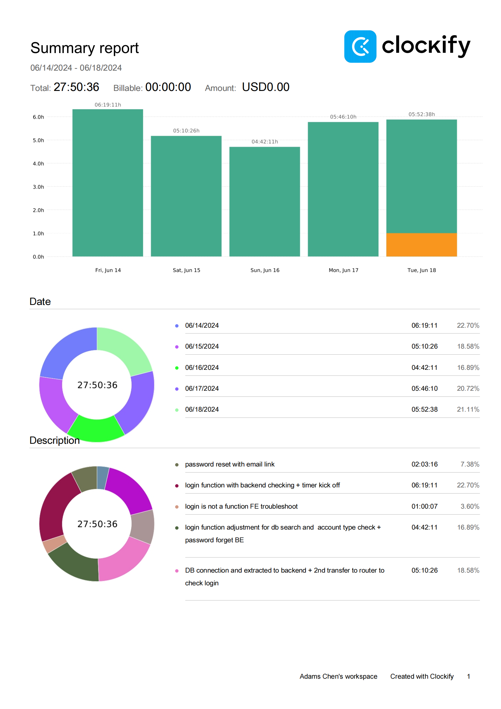
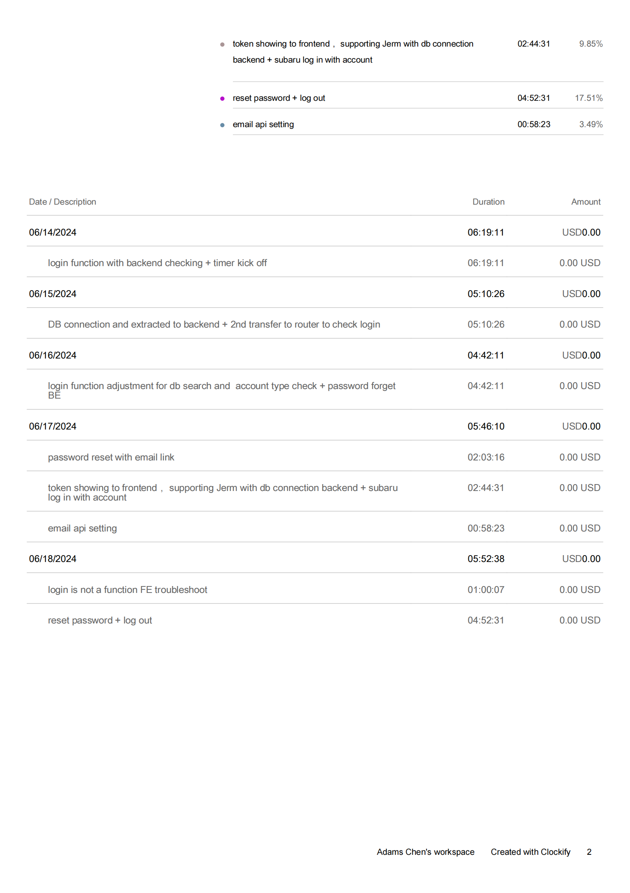
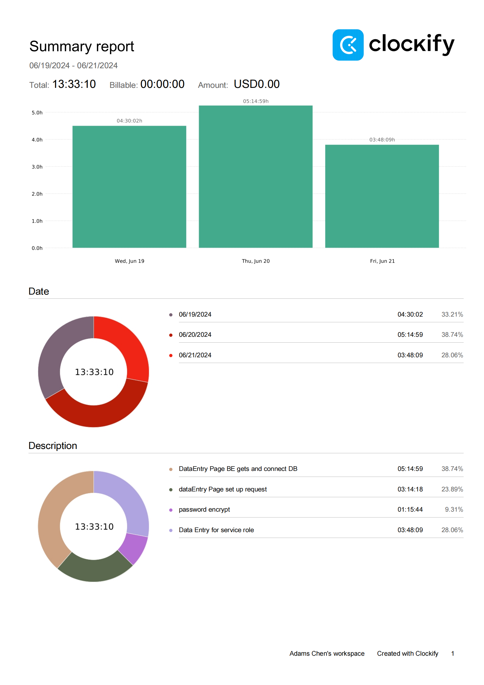
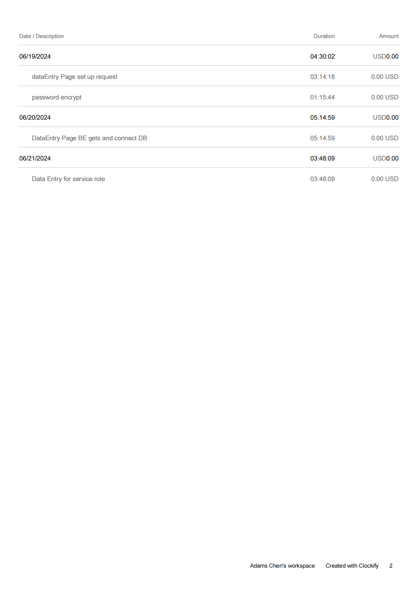

## Wednesday (6/19/2024)

### Timesheet

### Current Tasks
  * #1: Log out + deacive authentication 
  * #2: encrypt password 

### Progress Update (since 6/14/2024)
<table>
    <tr>
        <td><strong>TASK/ISSUE #</strong>
        </td>
        <td><strong>STATUS</strong>
        </td>
    </tr>
    <tr>
        <!-- Task/Issue # -->
        <td>Log in with authentication
        </td>
        <!-- Status -->
        <td>Finished
        </td>
    </tr>   
</table>

### Weekly Goal Review

Authentication log in finished. Support on trouble shooting for front-end require token and other features.

Explaining code and logic for guiding front end setting up proper request to backend to ask for target data.

### Next Cycle Goals
  * log out function
  * make password encryped
  * course history page BE

<!--------------------------------------------------------------------------------------------------------------------------------------------------------------------------------------------->
## Friday (6/21/2024)

### Timesheet

### Current Tasks
  * #1: Data Entry BE to add data in data base

### Progress Update (since 6/5/2024)
<table>
    <tr>
        <td><strong>TASK/ISSUE #</strong>
        </td>
        <td><strong>STATUS</strong>
        </td>
    </tr>
    <tr>
        <!-- Task/Issue # -->
        <td> password encrypt
          </td>
        <!-- Status -->
        <td> Done
          </td>
    </tr>
    <tr>
        <!-- Task/Issue # -->
        <td> Data Entry start up
          </td>
        <!-- Status -->
        <td> In progress
          </td>
    </tr>
</table>

### Weekly Goal Review

Login function fixed for allowing all accounts login successfully, account type is checked and allow FE to guide to different pages. Password is encrypted for safety. Data Entry page connected to BE and is ready for entering data.

### Next Cycle Goals
  * Goal 1 Enter data with FE input to data base.
