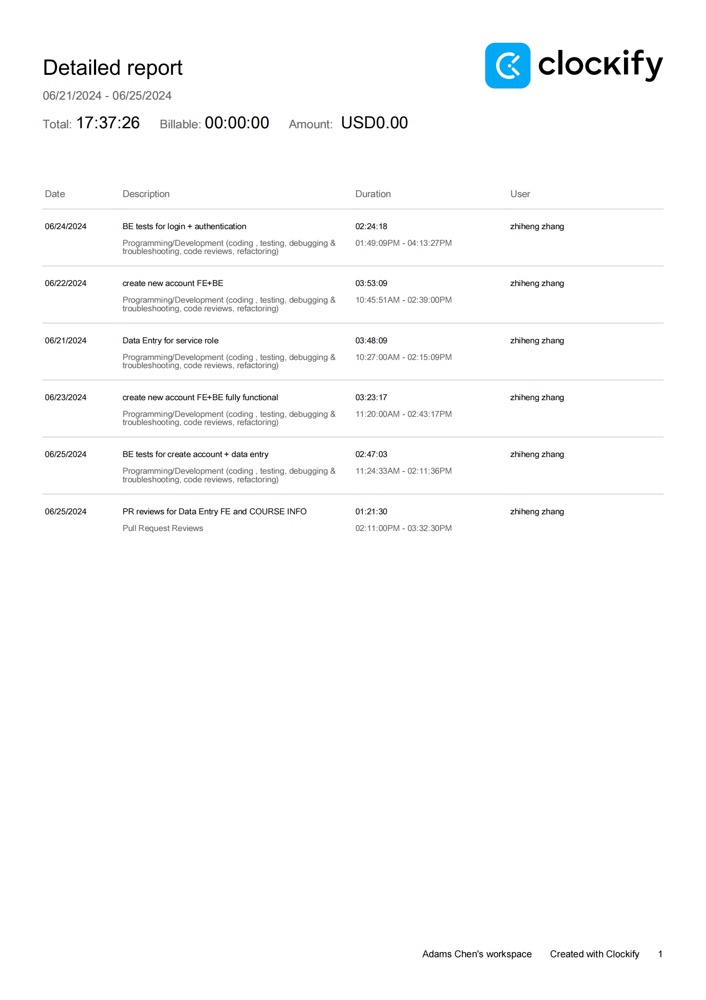
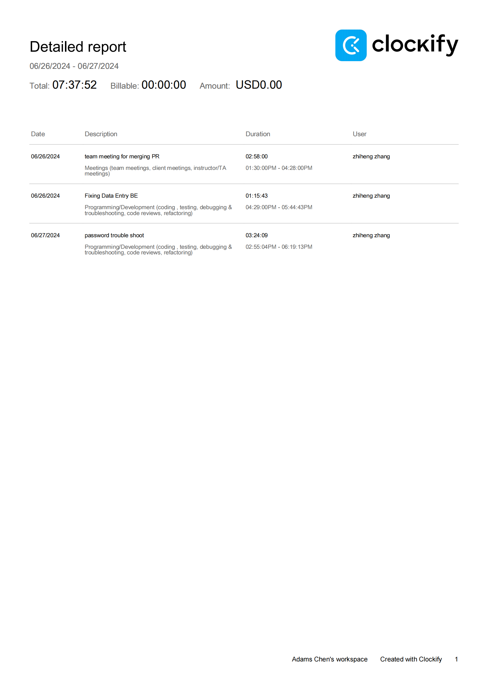

## Wednesday (6/25/2024)

### Timesheet

### Current Tasks
  * #1: Testing BE functions 

### Progress Update (since 6/21/2024)
<table>
    <tr>
        <td><strong>TASK/ISSUE #</strong>
        </td>
        <td><strong>STATUS</strong>
        </td>
    </tr>
    <tr>
        <!-- Task/Issue # -->
        <td>Data Entry
        </td>
        <!-- Status -->
        <td>Finished
        </td>
    </tr>   
</table>

### Weekly Goal Review
  *  Data Entry for new course + instructor is done. 
  *  Create new account is finished. 
  *  Waiting FE Data entry page finished to add assign people function BE.

### Next Cycle Goals
  * write tests for existing BE functions
  * If FE is finished, would complete assign people function.

<!--------------------------------------------------------------------------------------------------------------------------------------------------------------------------------------------->
## Friday (6/28/2024)

### Timesheet

### Current Tasks
  * #1: Re-set up password function

### Progress Update (since 6/5/2024)
<table>
    <tr>
        <td><strong>TASK/ISSUE #</strong>
        </td>
        <td><strong>STATUS</strong>
        </td>
    </tr>
    <tr>
        <!-- Task/Issue # -->
        <td> trouble shhot of previous password function
          </td>
        <!-- Status -->
        <td> done
          </td>
    </tr>
    <tr>
        <!-- Task/Issue # -->
        <td> start a new password checking
          </td>
        <!-- Status -->
        <td> In progress
          </td>
    </tr>
</table>

### Weekly Goal Review

Still waiting data entry front end assign person window to be finished, passwoerd function has problems when new features are implemented and problem is targeted.

Would finish a new password login in next cycle.

### Next Cycle Goals
  * Goal 1 New password login function BE
  * Goal 2 Wrting tests for existing BE functions
  * Goal 3 Hop to start Assign person ASAP
