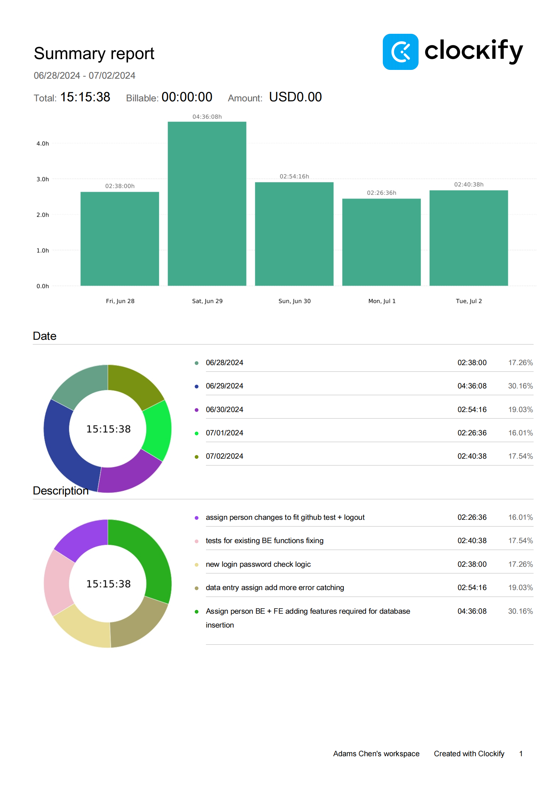
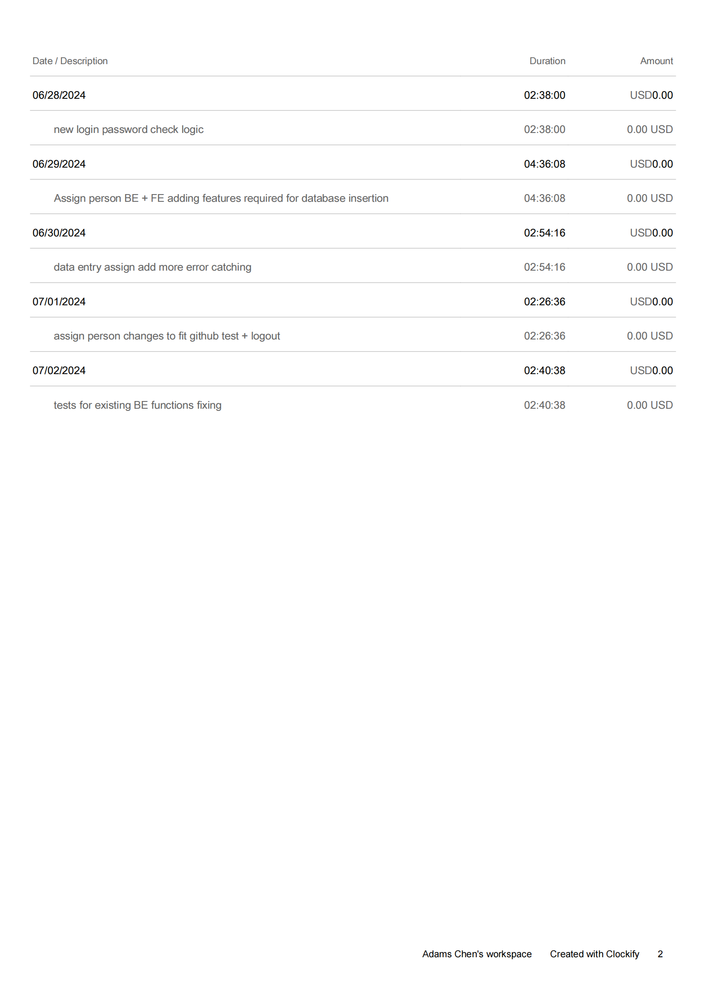
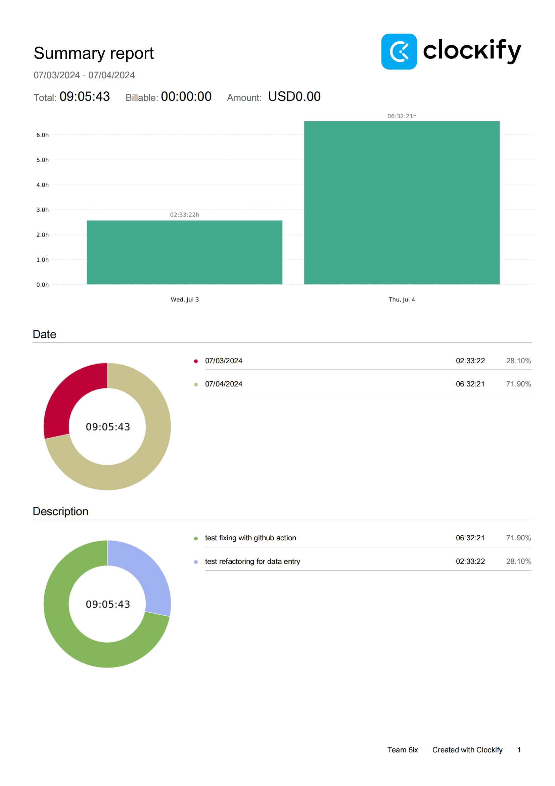
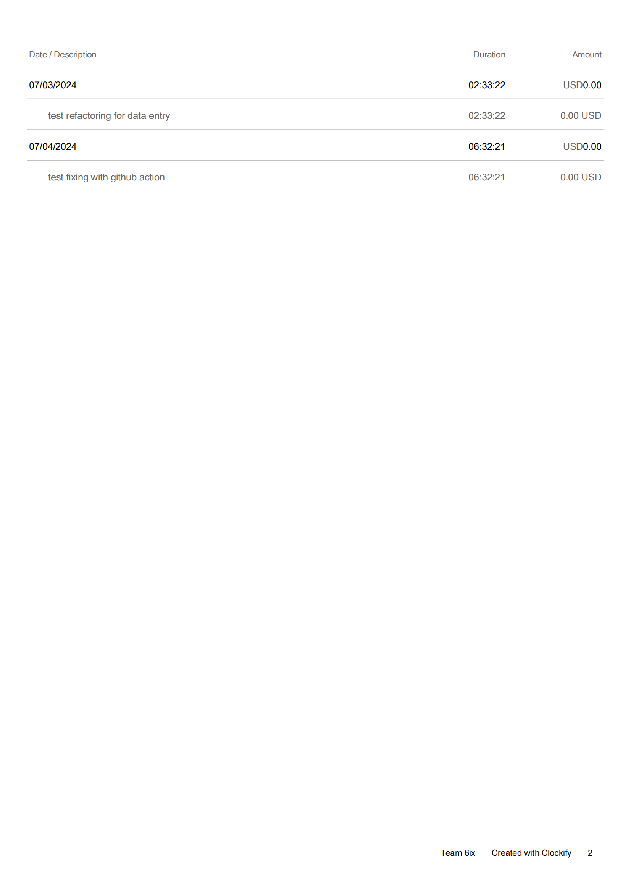

## Wednesday (7/03/2024)

### Timesheet

### Current Tasks
  
  * #1: Wrting tests for finished functions BE

### Progress Update (since 6/28/2024)
<table>
    <tr>
        <td><strong>TASK/ISSUE #</strong>
        </td>
        <td><strong>STATUS</strong>
        </td>
    </tr>
    <tr>
        <!-- Task/Issue # -->
        <td>Data Entry Assign Person
        </td>
        <!-- Status -->
        <td>Finished
        </td>
    </tr>   
</table>

### Goal Review
  *  New password checking logic finished
  *  logout function finished. 
  *  Data Entry for assign person to course/service role finished. 

### Next Cycle Goals
  * write tests for more existing BE function

<!--------------------------------------------------------------------------------------------------------------------------------------------------------------------------------------------->
## Friday (7/5/2024)

### Timesheet

### Current Tasks
  * #1: Create Account test fixing

### Progress Update (since 6/5/2024)
<table>
    <tr>
        <td><strong>TASK/ISSUE #</strong>
        </td>
        <td><strong>STATUS</strong>
        </td>
    </tr>
    <tr>
        <!-- Task/Issue # -->
        <td> BE existing tests for MVP
          </td>
        <!-- Status -->
        <td> done
          </td>
    </tr>
</table>

### Weekly Goal Review

All tests required for MVP is completed and pass github action test. Create Account test needs some problem shooting but it's not in MVP plan so I would work on it for next cycle.

### Next Cycle Goals
  * Goal 1 Create Account test
  * Goal 2A Img for personal profile
  * Goal 2B Edit Profile BE+Test
