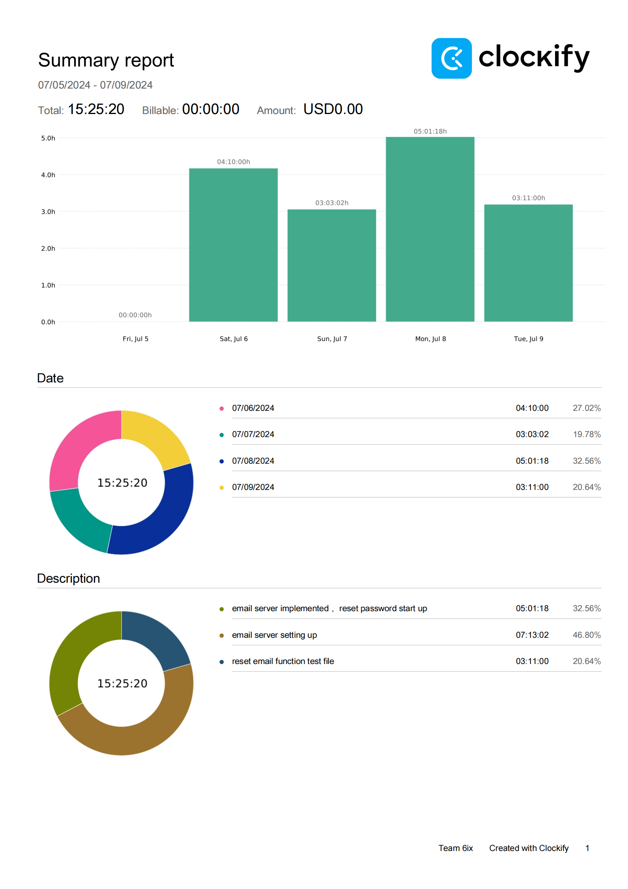
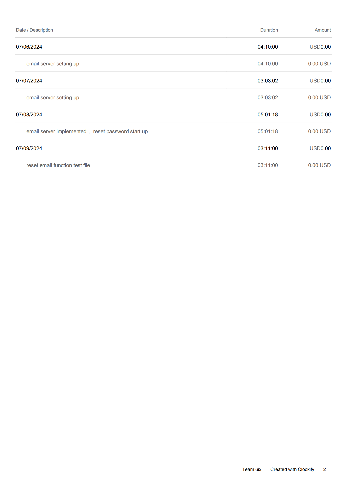

## Wednesday (7/03/2024)

### Timesheet

### Current Tasks
  
  * #1: Reset password email request
  * #2: Reset/update password with hash protect
  * #3: new password update in data base

### Progress Update (since 7/5/2024)
<table>
    <tr>
        <td><strong>TASK/ISSUE #</strong>
        </td>
        <td><strong>STATUS</strong>
        </td>
    </tr>
    <tr>
        <!-- Task/Issue # -->
        <td>email service
        </td>
        <!-- Status -->
        <td>Finished
        </td>
    </tr>  
  <tr>
        <!-- Task/Issue # -->
        <td>reset password request
        </td>
        <!-- Status -->
        <td>Finished
        </td>
    </tr>  
  <tr>
        <!-- Task/Issue # -->
        <td>new password hash protect
        </td>
        <!-- Status -->
        <td>Finished
        </td>
    <tr>
        <!-- Task/Issue # -->
        <td>new password update data base
        </td>
        <!-- Status -->
        <td>Finished
        </td>
    </tr> 
   <tr>
        <!-- Task/Issue # -->
        <td>email sending test
        </td>
        <!-- Status -->
        <td>Finished
        </td>
    </tr> 
    </tr>  
</table>

### Goal Review

  *  completes all schedualed goal 

### Next Cycle Goals

  * solve email test problem on github action
  * token refresh for longer active time

<!--------------------------------------------------------------------------------------------------------------------------------------------------------------------------------------------->
## Friday (7/12/2024)

### Timesheet

### Current Tasks
  * #1: 

### Progress Update (since 6/5/2024)
<table>
    <tr>
        <td><strong>TASK/ISSUE #</strong>
        </td>
        <td><strong>STATUS</strong>
        </td>
    </tr>
    <tr>
        <!-- Task/Issue # -->
        <td> 
          </td>
        <!-- Status -->
        <td> 
          </td>
    </tr>
</table>

### Weekly Goal Review

### Next Cycle Goals
  * Goal 1 
  * Goal 2A 
  * Goal 2B 
